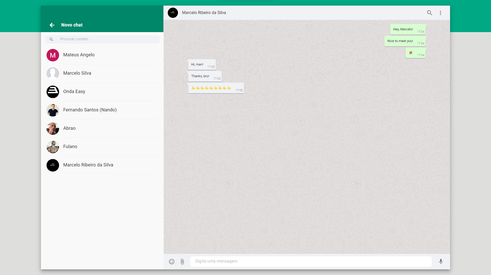
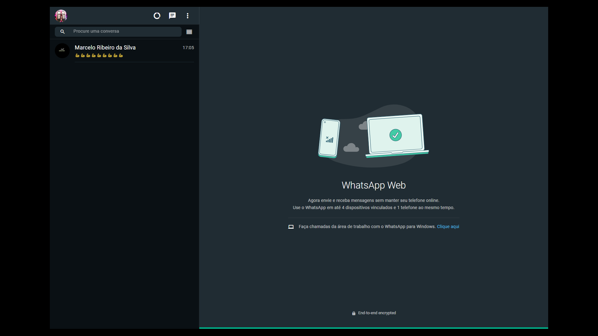

<h1 align="center" style="color: #f1f1f1f1">

	WhatsApp Clone
</h1>

Personal project that I develop in order to test my skills and knowledge in Lists(arrays), useContext, useCallback, memo and useMemo do
To react.

All data sent and received were treated through global opinions created within my context. This made it much easier to deal with comparisons and relationships between the main user, who will be the logged-in user, and the secondary users, who will be your logged-in contacts on the other side of the screen and also the chats.

It's also worth mentioning the fact that Typescript is very useful in projects like this. In addition to the security that we have from non-original non-typing and that helps our construction, we still have the intellisense of VSCode to give us completing the typed objects.
It's surreal and saves a lot of time and headaches. 😂
Have you ever thought about stopping to remember the name of each field that is inside the mapped object.

Finally, I used Firebase on the backend, but I have to confess that it wasn't a simple experience, let alone an easy one.😂
But it is an extraordinary tool and I am sure I will continue to study it and use it in new projects, both personal and professional.

 

## 🚀 Starting

If you want access for this application, click here: https://real-whatsapp-clone.netlify.app/

 

## 🛠️ Built with

Technologies used in this project

-   [React](https://reactjs.org/docs/getting-started.html)
-   [Typescript](https://www.typescriptlang.org/docs/)
-   [Vite](https://vitejs.dev/guide/#trying-vite-online) - Bundle of project create
-   [Material Ui](https://mui.com/) - Design system for
-   [ESLint](https://www.npmjs.com/package/eslint) - For rules of writing code
-   [Axios](https://axios-http.com/ptbr/docs/intro) - Requests for API
-   [Google Firebase](https://firebase.google.com/) - back-end

 

## 🖇️ Collaborating

Please, collaborate with project. I would be very happy.

Thanks. 👋🚀

 

## 🚧 Observation

I emphasize that I didn't make it responsive because it's a clone of an application for browsers on desktops, but I might do it later, I just don't think it's necessary to do that now.

 

## 📌 Version

I'm used the Git/Hub for controller of version is this project. All commits and all alterations, they are here.

 

## ✒️ Authors

-   **Marcelo Silva** - _Front-End_ - [ GitHub Profile](https://github.com/EuMarcel0)
     

## 📄 License

This project is open source.

 

## 🎁 Expression of gratitude

I'm very, very happy for concluded this project. 🚀👋

 

## 💻 Prints of app

Light theme

  

Dark theme

